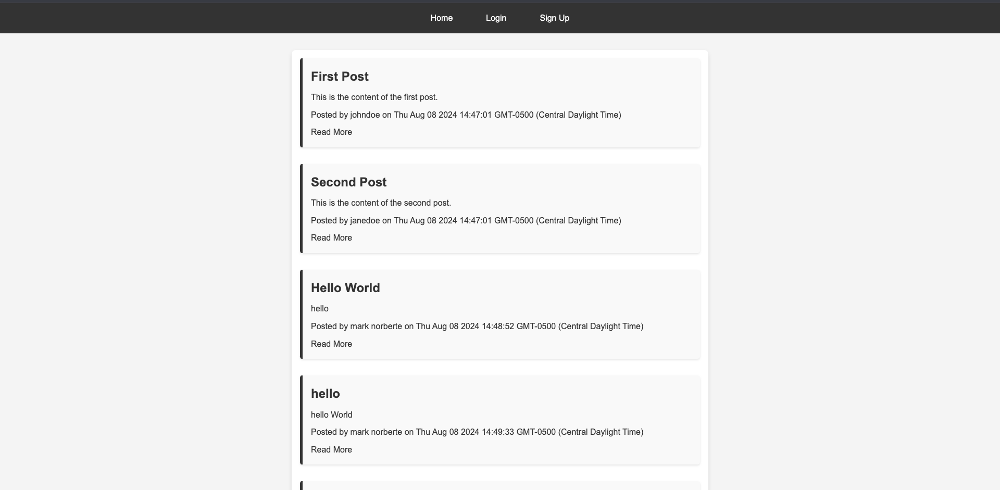
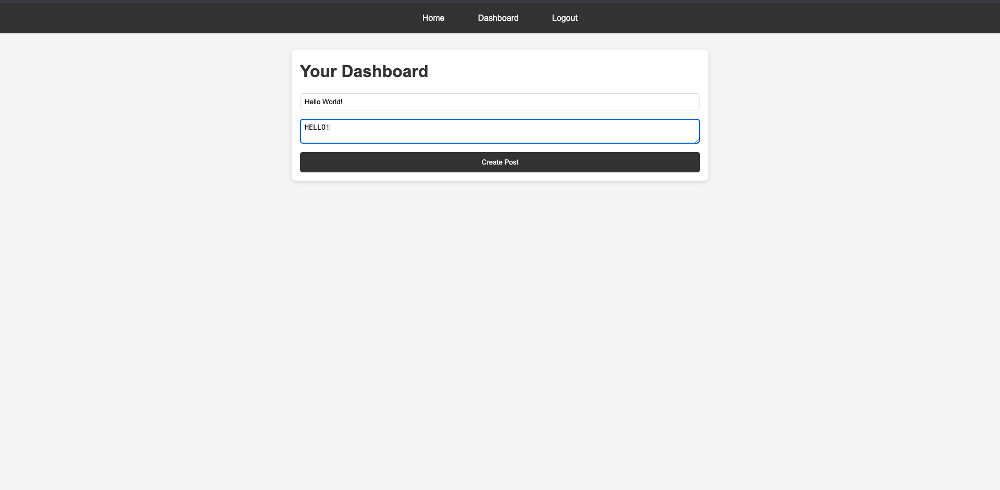

# CMS Blog

## Project Description

CMS Blog is a Content Management System (CMS)-style blog site where developers can publish their blog posts, share their thoughts, and comment on other developers' posts. The application is built following the MVC paradigm, with authentication handled through `express-session` and `connect-session-sequelize`. It provides a clean and simple interface for developers to interact with, post their content, and engage with others in the community.


## Table of Contents
- [Project Description](#project-description)
- [Features](#features)
- [Installation](#installation)
- [Usage](#usage)
- [Screenshots](#screenshots)
- [Technologies Used](#technologies-used)
- [Contributions](#Contributions)
- [License](#license)


## Features

- **User Authentication**: Sign up, log in, and log out functionalities with secure session management.
- **Post Creation**: Authenticated users can create, update, and delete their blog posts.
- **Comment System**: Users can comment on posts and engage in discussions.
- **Responsive Design**: A clean, responsive UI that works well on both desktop and mobile devices.
- **Seamless Navigation**: Easy navigation between the homepage, dashboard, and other sections.
- **MVC Architecture**: Separation of concerns with Models, Views, and Controllers to manage the application's flow.

## Installation

To set up the project locally, follow these steps:

1. **Clone the Repository**:
   ```bash
   git clone https://github.com/yourusername/cms-blog.git
   cd cms-blog
2. **Install Dependencies**
    ```bash
    npm install
3. **Set Up Environment Variables**

- create a '.env' file in the root directory and add the following environment variables.
    ```bash
        DB_NAME="devblog_db"
        DB_USER="your_postgres_username"
        DB_PASSWORD="your_postgres_password"
        DB_HOST="localhost"
        DB_DIALECT="postgres"
        SESSION_SECRET="your_secret"
4. Create the Database:
- Use the PostgreSQL client to create the database:
    ```bash
        psql -U your_postgres_username -d postgres
        CREATE DATABASE devblog_db;
5. **Run Database Migrations:**
- Sync the models with the database:
    ```bash
    npm run seed
6. **Start the Application**
    ```bash
    npm start
7. **Visit the Application**
- Open a chrome web browswer and go to
     ``` bash
        http://localhost:3001

## Usage

### Once the application is running:

1. Sign Up: Create an account by providing a username and password.
2. Log In: Access your account by logging in with your credentials.
3. Dashboard: Once logged in, you can create new blog posts from your dashboard.
4. View and Comment on Posts: View blog posts on the homepage and leave comments.
5. Manage Your Posts: Edit or delete your posts from the dashboard.

## Screenshots

- **Homepage**

- **Dashboard**

- **Post** 


## Technologies Used

- Node.js: JavaScript runtime for server-side code.
- Express.js: Web application framework for handling routes and middleware.
- Sequelize: ORM for PostgreSQL database management.
- PostgreSQL: Relational database used to store users, posts, and comments.
- Handlebars.js: Templating engine for rendering views.
- express-session: Session management middleware.
- connect-session-sequelize: Sequelize-based session store.
- bcrypt: Password hashing for secure user authentication.
- dotenv: Environment variable management.

## Contributions are welcome! 
`To contribute:`

1. Fork the repository.
2. Create a new branch:
    ```bash
    git checkout -b feature/your-feature-name


3. Make your changes and commit them:
    ```bash
    git commit -m 'Add some feature'

4. Push to the branch:
    ```bash
    git push origin feature/your-feature-name
5. Open a pull request.
Please make sure to update tests as appropriate and follow the code style guidelines.

License

This project is licensed under the MIT License - see the [LICENSE](LICENSE) file for details.

